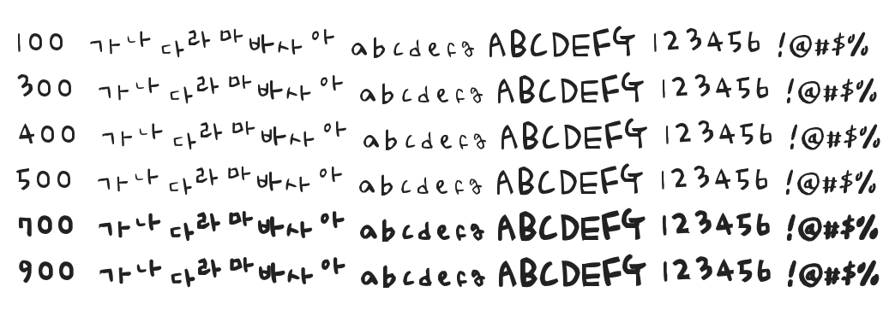

# @noonnu/solinsunny-r

솔인써니체 - 갑자기 여름이 찾아왔다



## Install

```bash
npm install @noonnu/solinsunny-r --save
```

### Import the CSS file

```js
import '@noonnu/solinsunny-r' // esm
// or
require('@noonnu/solinsunny-r') // cjs
```

#### [css-loader](https://github.com/webpack-contrib/css-loader)

```css
@import url('~@noonnu/solinsunny-r');
```

## Usage

```css
body {
    font-family: SolinsunnyR;
}
```

## Link

https://noonnu.cc/font_page/409
