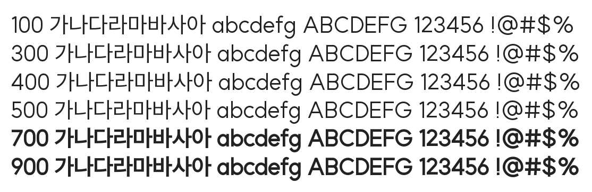

# @noonnu/suit-regular

수트 - 폰트 굵기가 진짜 다양하다



## Install

```bash
npm install @noonnu/suit-regular --save
```

### Import the CSS file

```js
import '@noonnu/suit-regular' // esm
// or
require('@noonnu/suit-regular') // cjs
```

#### [css-loader](https://github.com/webpack-contrib/css-loader)

```css
@import url('~@noonnu/suit-regular');
```

## Usage

```css
body {
    font-family: SUIT-Regular;
}
```

## Link

https://noonnu.cc/font_page/845
