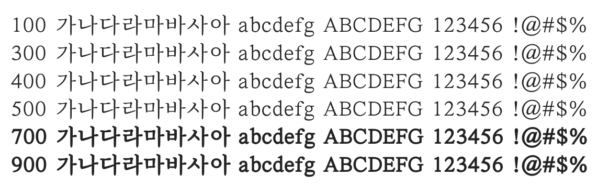

# @noonnu/sun-batang-light

순바탕 - 바람이 산들산들 불고 하늘이 파란 날



## Install

```bash
npm install @noonnu/sun-batang-light --save
```

### Import the CSS file

```js
import '@noonnu/sun-batang-light' // esm
// or
require('@noonnu/sun-batang-light') // cjs
```

#### [css-loader](https://github.com/webpack-contrib/css-loader)

```css
@import url('~@noonnu/sun-batang-light');
```

## Usage

```css
body {
    font-family: SunBatang-Light;
}
```

## Link

https://noonnu.cc/font_page/289
