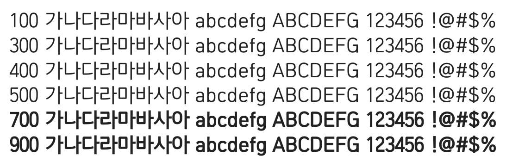

# @noonnu/suncheon-r

순천체 - 식물이 나에게 힘을 많이 준다



## Install

```bash
npm install @noonnu/suncheon-r --save
```

### Import the CSS file

```js
import '@noonnu/suncheon-r' // esm
// or
require('@noonnu/suncheon-r') // cjs
```

#### [css-loader](https://github.com/webpack-contrib/css-loader)

```css
@import url('~@noonnu/suncheon-r');
```

## Usage

```css
body {
    font-family: SuncheonR;
}
```

## Link

https://noonnu.cc/font_page/875
