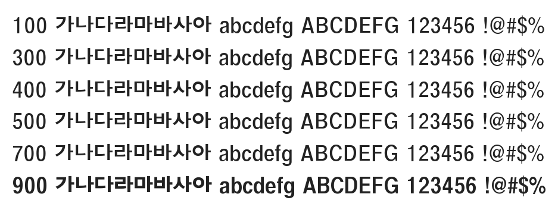

# @noonnu/sung-dong-gothic

성동고딕 - 여행갔다 돌아와선 현타맞음



## Install

```bash
npm install @noonnu/sung-dong-gothic --save
```

### Import the CSS file

```js
import '@noonnu/sung-dong-gothic' // esm
// or
require('@noonnu/sung-dong-gothic') // cjs
```

#### [css-loader](https://github.com/webpack-contrib/css-loader)

```css
@import url('~@noonnu/sung-dong-gothic');
```

## Usage

```css
body {
    font-family: SungDongGothic;
}
```

## Link

https://noonnu.cc/font_page/26
