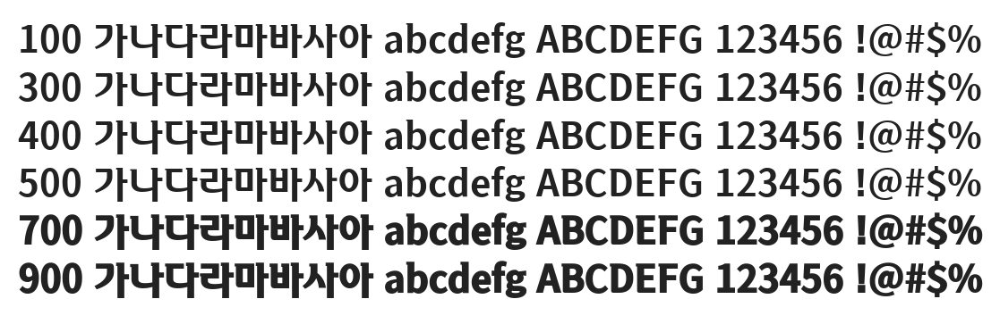

# @noonnu/sunmoonuniversity

선문대체 - 활기가 돌아오는 대학교



## Install

```bash
npm install @noonnu/sunmoonuniversity --save
```

### Import the CSS file

```js
import '@noonnu/sunmoonuniversity' // esm
// or
require('@noonnu/sunmoonuniversity') // cjs
```

#### [css-loader](https://github.com/webpack-contrib/css-loader)

```css
@import url('~@noonnu/sunmoonuniversity');
```

## Usage

```css
body {
    font-family: SUNMOONUNIVERSITY;
}
```

## Link

https://noonnu.cc/font_page/1054
