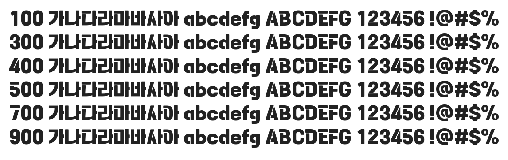

# @noonnu/tenada

태나다체 - 뭐든지 잘해볼 수 있을 것 같은 기분



## Install

```bash
npm install @noonnu/tenada --save
```

### Import the CSS file

```js
import '@noonnu/tenada' // esm
// or
require('@noonnu/tenada') // cjs
```

#### [css-loader](https://github.com/webpack-contrib/css-loader)

```css
@import url('~@noonnu/tenada');
```

## Usage

```css
body {
    font-family: Tenada;
}
```

## Link

https://noonnu.cc/font_page/1042
