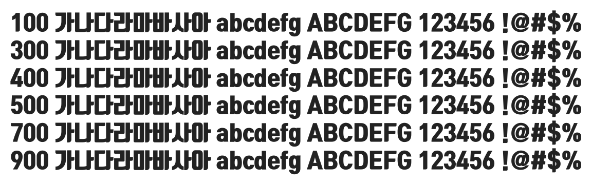

# @noonnu/tmon-monsori

티몬체 - 뭔소리 하는건지 나도 몰라



## Install

```bash
npm install @noonnu/tmon-monsori --save
```

### Import the CSS file

```js
import '@noonnu/tmon-monsori' // esm
// or
require('@noonnu/tmon-monsori') // cjs
```

#### [css-loader](https://github.com/webpack-contrib/css-loader)

```css
@import url('~@noonnu/tmon-monsori');
```

## Usage

```css
body {
    font-family: TmonMonsori;
}
```

## Link

https://noonnu.cc/font_page/72
