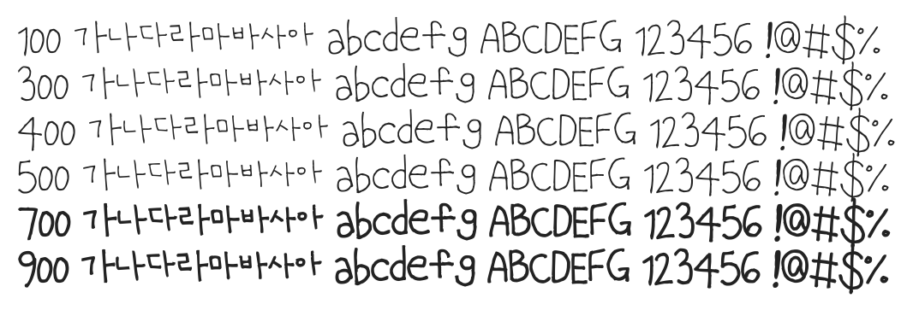

# @noonnu/uh-bee-beojji

어비 버찌체 - 버찌가 참 맛있던데, 너도 먹었어?



## Install

```bash
npm install @noonnu/uh-bee-beojji --save
```

### Import the CSS file

```js
import '@noonnu/uh-bee-beojji' // esm
// or
require('@noonnu/uh-bee-beojji') // cjs
```

#### [css-loader](https://github.com/webpack-contrib/css-loader)

```css
@import url('~@noonnu/uh-bee-beojji');
```

## Usage

```css
body {
    font-family: UhBeeBEOJJI;
}
```

## Link

https://noonnu.cc/font_page/136
