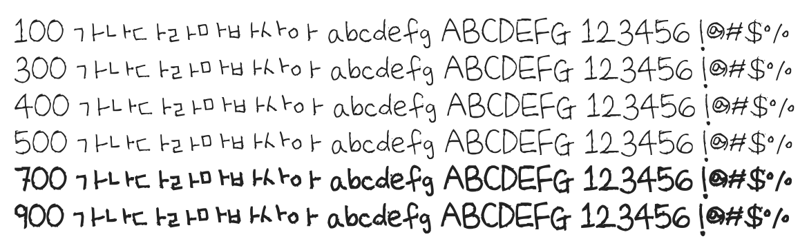

# @noonnu/uh-bee-eunkyung

어비 은경체 - 귀엽게 보이기 시작했다면 덕질에 출구는 없다



## Install

```bash
npm install @noonnu/uh-bee-eunkyung --save
```

### Import the CSS file

```js
import '@noonnu/uh-bee-eunkyung' // esm
// or
require('@noonnu/uh-bee-eunkyung') // cjs
```

#### [css-loader](https://github.com/webpack-contrib/css-loader)

```css
@import url('~@noonnu/uh-bee-eunkyung');
```

## Usage

```css
body {
    font-family: UhBeeEUNKYUNG;
}
```

## Link

https://noonnu.cc/font_page/146
