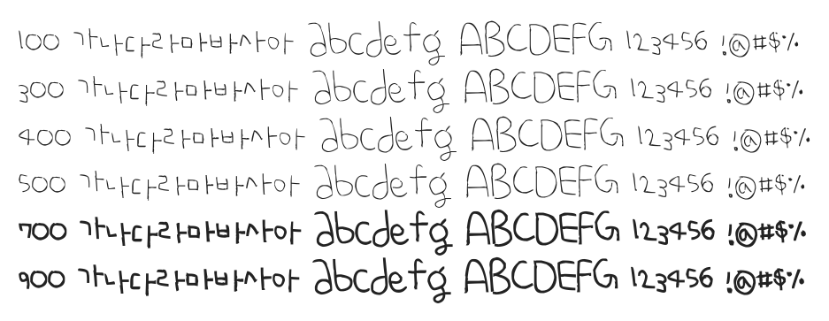

# @noonnu/uh-bee-ham

어비 햄체 - 햄 냠냠 먹고 싶다 소시지 햄 좋아



## Install

```bash
npm install @noonnu/uh-bee-ham --save
```

### Import the CSS file

```js
import '@noonnu/uh-bee-ham' // esm
// or
require('@noonnu/uh-bee-ham') // cjs
```

#### [css-loader](https://github.com/webpack-contrib/css-loader)

```css
@import url('~@noonnu/uh-bee-ham');
```

## Usage

```css
body {
    font-family: UhBeeHam;
}
```

## Link

https://noonnu.cc/font_page/149
