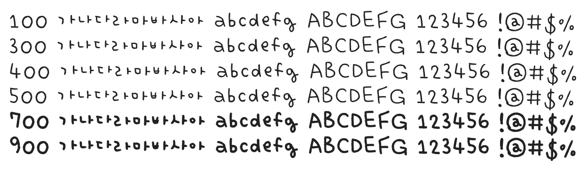

# @noonnu/uh-bee-han-huey

어비 하뉴이체 - 하누이 놀러가면 좋더니? 음식은 맛있어?



## Install

```bash
npm install @noonnu/uh-bee-han-huey --save
```

### Import the CSS file

```js
import '@noonnu/uh-bee-han-huey' // esm
// or
require('@noonnu/uh-bee-han-huey') // cjs
```

#### [css-loader](https://github.com/webpack-contrib/css-loader)

```css
@import url('~@noonnu/uh-bee-han-huey');
```

## Usage

```css
body {
    font-family: UhBeeHanHUEY;
}
```

## Link

https://noonnu.cc/font_page/151
