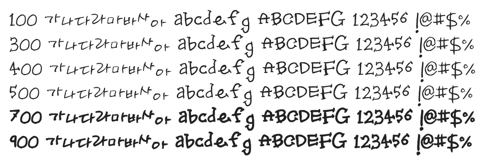

# @noonnu/uh-bee-jiyoung

어비 지영체 - 달콤한 걸 먹으면 좀 기분이 나아질거야



## Install

```bash
npm install @noonnu/uh-bee-jiyoung --save
```

### Import the CSS file

```js
import '@noonnu/uh-bee-jiyoung' // esm
// or
require('@noonnu/uh-bee-jiyoung') // cjs
```

#### [css-loader](https://github.com/webpack-contrib/css-loader)

```css
@import url('~@noonnu/uh-bee-jiyoung');
```

## Usage

```css
body {
    font-family: UhBeeJiyoung;
}
```

## Link

https://noonnu.cc/font_page/159
