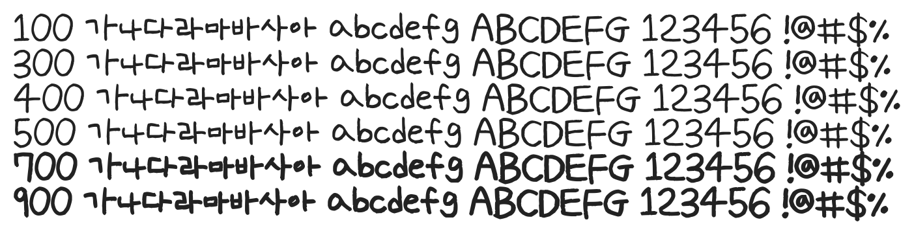

# @noonnu/uh-bee-keong-keong

어비 컹컹체 - 바나나는 노랗고 뉸도 노랗다



## Install

```bash
npm install @noonnu/uh-bee-keong-keong --save
```

### Import the CSS file

```js
import '@noonnu/uh-bee-keong-keong' // esm
// or
require('@noonnu/uh-bee-keong-keong') // cjs
```

#### [css-loader](https://github.com/webpack-contrib/css-loader)

```css
@import url('~@noonnu/uh-bee-keong-keong');
```

## Usage

```css
body {
    font-family: UhBeeKeongKeong;
}
```

## Link

https://noonnu.cc/font_page/167
