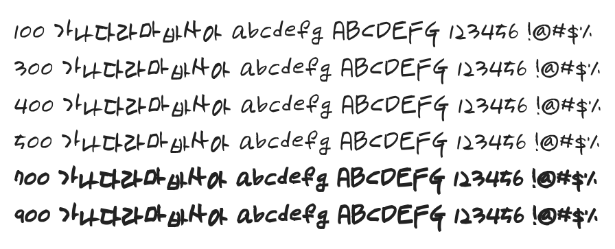

# @noonnu/uh-bee-motomi

어비 모토미체 - 폰트는 가독성이 중요한 것 같다



## Install

```bash
npm install @noonnu/uh-bee-motomi --save
```

### Import the CSS file

```js
import '@noonnu/uh-bee-motomi' // esm
// or
require('@noonnu/uh-bee-motomi') // cjs
```

#### [css-loader](https://github.com/webpack-contrib/css-loader)

```css
@import url('~@noonnu/uh-bee-motomi');
```

## Usage

```css
body {
    font-family: UhBeeMotomi;
}
```

## Link

https://noonnu.cc/font_page/175
