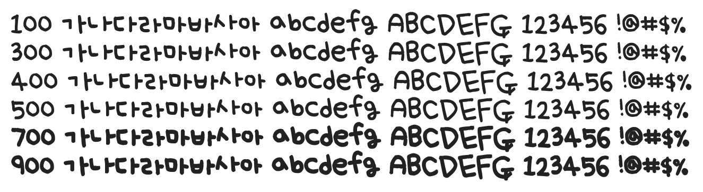

# @noonnu/uh-bee-se-hyun

어비 세현체 - 너가 사랑하는 일을 해라



## Install

```bash
npm install @noonnu/uh-bee-se-hyun --save
```

### Import the CSS file

```js
import '@noonnu/uh-bee-se-hyun' // esm
// or
require('@noonnu/uh-bee-se-hyun') // cjs
```

#### [css-loader](https://github.com/webpack-contrib/css-loader)

```css
@import url('~@noonnu/uh-bee-se-hyun');
```

## Usage

```css
body {
    font-family: UhBeeSe_hyun;
}
```

## Link

https://noonnu.cc/font_page/187
