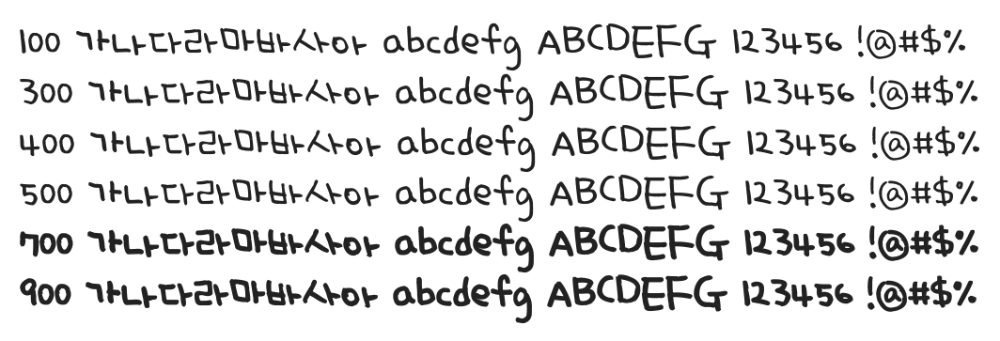

# @noonnu/uh-bee-skyrain

어비 하늘비체 - 하늘에서 비가 주륵주륵 번개가 번쩍



## Install

```bash
npm install @noonnu/uh-bee-skyrain --save
```

### Import the CSS file

```js
import '@noonnu/uh-bee-skyrain' // esm
// or
require('@noonnu/uh-bee-skyrain') // cjs
```

#### [css-loader](https://github.com/webpack-contrib/css-loader)

```css
@import url('~@noonnu/uh-bee-skyrain');
```

## Usage

```css
body {
    font-family: UhBeeSkyrain;
}
```

## Link

https://noonnu.cc/font_page/190
