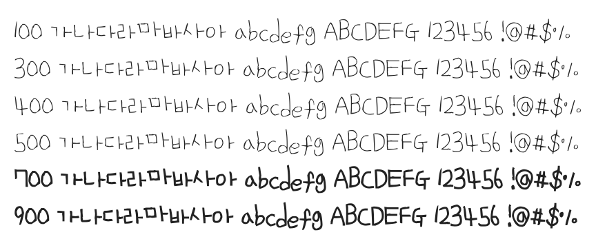

# @noonnu/uh-bee-strawberry

어비 스트로베리체 - 딸기는 통통하고 빨간게 맛있지



## Install

```bash
npm install @noonnu/uh-bee-strawberry --save
```

### Import the CSS file

```js
import '@noonnu/uh-bee-strawberry' // esm
// or
require('@noonnu/uh-bee-strawberry') // cjs
```

#### [css-loader](https://github.com/webpack-contrib/css-loader)

```css
@import url('~@noonnu/uh-bee-strawberry');
```

## Usage

```css
body {
    font-family: UhBeeStrawberry;
}
```

## Link

https://noonnu.cc/font_page/193
