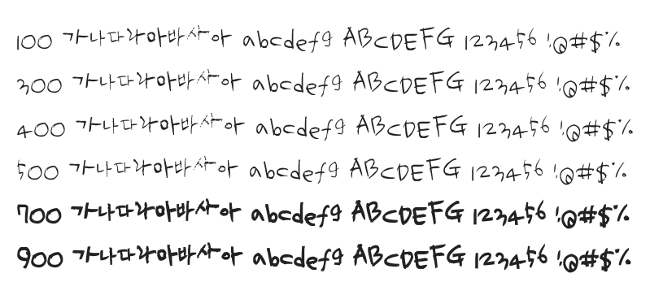

# @noonnu/uh-bee-uz

어비 유진체 - 고인돌에는 이끼가 끼기 마련이다



## Install

```bash
npm install @noonnu/uh-bee-uz --save
```

### Import the CSS file

```js
import '@noonnu/uh-bee-uz' // esm
// or
require('@noonnu/uh-bee-uz') // cjs
```

#### [css-loader](https://github.com/webpack-contrib/css-loader)

```css
@import url('~@noonnu/uh-bee-uz');
```

## Usage

```css
body {
    font-family: UhBeeUZ;
}
```

## Link

https://noonnu.cc/font_page/199
