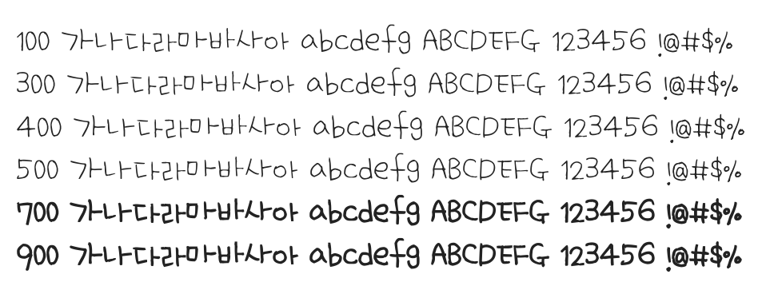

# @noonnu/uh-bee-yeonie

어비 여니체 - 타마고산도 먹어보고 싶다



## Install

```bash
npm install @noonnu/uh-bee-yeonie --save
```

### Import the CSS file

```js
import '@noonnu/uh-bee-yeonie' // esm
// or
require('@noonnu/uh-bee-yeonie') // cjs
```

#### [css-loader](https://github.com/webpack-contrib/css-loader)

```css
@import url('~@noonnu/uh-bee-yeonie');
```

## Usage

```css
body {
    font-family: UhBeeYeonie;
}
```

## Link

https://noonnu.cc/font_page/204
