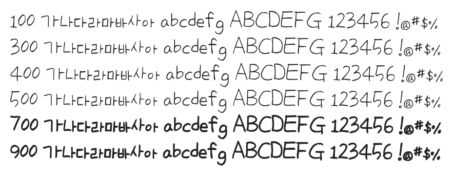

# @noonnu/uh-bee-yiseul

어비 이슬체 - 추운날씨에 이슬이 소록소록 생겼다



## Install

```bash
npm install @noonnu/uh-bee-yiseul --save
```

### Import the CSS file

```js
import '@noonnu/uh-bee-yiseul' // esm
// or
require('@noonnu/uh-bee-yiseul') // cjs
```

#### [css-loader](https://github.com/webpack-contrib/css-loader)

```css
@import url('~@noonnu/uh-bee-yiseul');
```

## Usage

```css
body {
    font-family: UhBeeYiseul;
}
```

## Link

https://noonnu.cc/font_page/205
