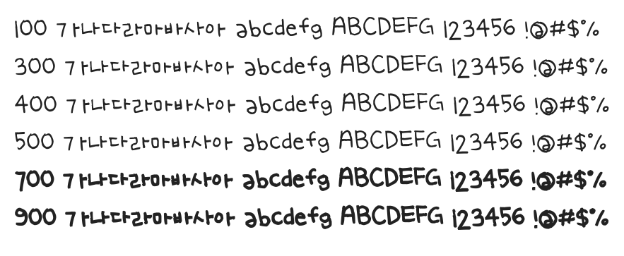

# @noonnu/uh-bee-zigle

어비 지글체 - 지글지글 보글보글 찌게가 끓는다



## Install

```bash
npm install @noonnu/uh-bee-zigle --save
```

### Import the CSS file

```js
import '@noonnu/uh-bee-zigle' // esm
// or
require('@noonnu/uh-bee-zigle') // cjs
```

#### [css-loader](https://github.com/webpack-contrib/css-loader)

```css
@import url('~@noonnu/uh-bee-zigle');
```

## Usage

```css
body {
    font-family: UhBeeZIGLE;
}
```

## Link

https://noonnu.cc/font_page/208
