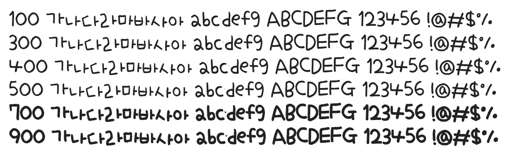

# @noonnu/uh-beecharming

어비 챠밍체 - 폰트가 많은데 뭘 써야할지 모르겠다



## Install

```bash
npm install @noonnu/uh-beecharming --save
```

### Import the CSS file

```js
import '@noonnu/uh-beecharming' // esm
// or
require('@noonnu/uh-beecharming') // cjs
```

#### [css-loader](https://github.com/webpack-contrib/css-loader)

```css
@import url('~@noonnu/uh-beecharming');
```

## Usage

```css
body {
    font-family: UhBeecharming;
}
```

## Link

https://noonnu.cc/font_page/139
