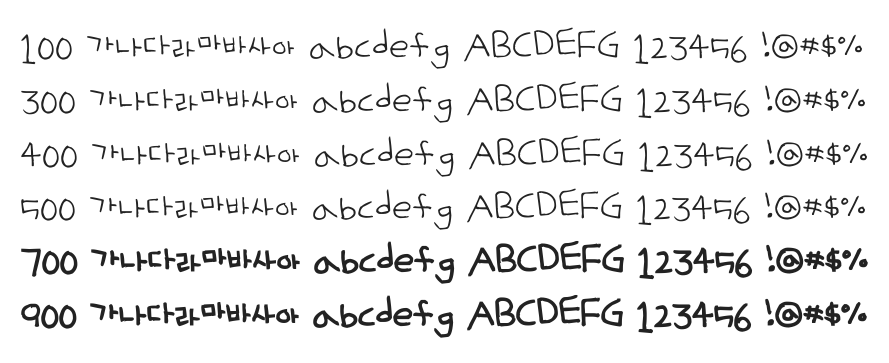

# @noonnu/uh-beehyemong

어비 혜몽체 - 일이 많고 손에 안잡히면 좀 쉬었다 해



## Install

```bash
npm install @noonnu/uh-beehyemong --save
```

### Import the CSS file

```js
import '@noonnu/uh-beehyemong' // esm
// or
require('@noonnu/uh-beehyemong') // cjs
```

#### [css-loader](https://github.com/webpack-contrib/css-loader)

```css
@import url('~@noonnu/uh-beehyemong');
```

## Usage

```css
body {
    font-family: UhBeehyemong;
}
```

## Link

https://noonnu.cc/font_page/154
