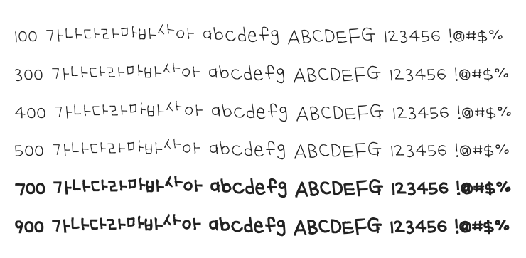

# @noonnu/uh-beemysen

어비 마이센체 - 손으로 쓰는게 더 빠를때도 있어



## Install

```bash
npm install @noonnu/uh-beemysen --save
```

### Import the CSS file

```js
import '@noonnu/uh-beemysen' // esm
// or
require('@noonnu/uh-beemysen') // cjs
```

#### [css-loader](https://github.com/webpack-contrib/css-loader)

```css
@import url('~@noonnu/uh-beemysen');
```

## Usage

```css
body {
    font-family: UhBeemysen;
}
```

## Link

https://noonnu.cc/font_page/178
