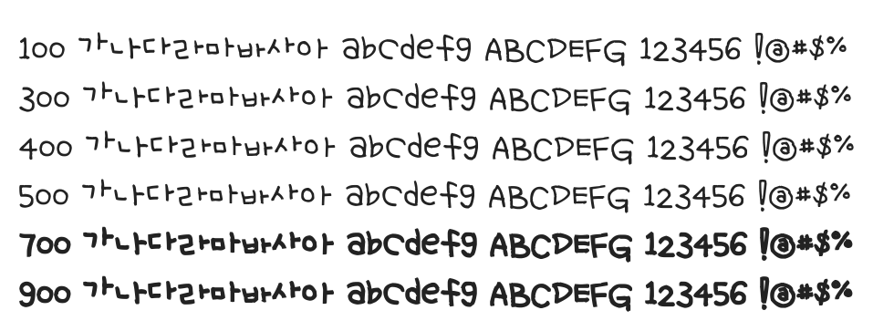

# @noonnu/uh-beepuding

어비 푸딩체 - 푸딩은 말랑말랑하고 달콤하고 맛있어



## Install

```bash
npm install @noonnu/uh-beepuding --save
```

### Import the CSS file

```js
import '@noonnu/uh-beepuding' // esm
// or
require('@noonnu/uh-beepuding') // cjs
```

#### [css-loader](https://github.com/webpack-contrib/css-loader)

```css
@import url('~@noonnu/uh-beepuding');
```

## Usage

```css
body {
    font-family: UhBeepuding;
}
```

## Link

https://noonnu.cc/font_page/181
