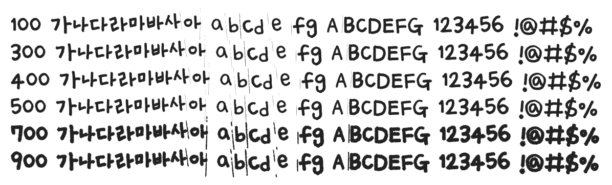

# @noonnu/uh-beeyoongdi

어비 융디체 - 카펫에 누워있으니 포근한 느낌이었다



## Install

```bash
npm install @noonnu/uh-beeyoongdi --save
```

### Import the CSS file

```js
import '@noonnu/uh-beeyoongdi' // esm
// or
require('@noonnu/uh-beeyoongdi') // cjs
```

#### [css-loader](https://github.com/webpack-contrib/css-loader)

```css
@import url('~@noonnu/uh-beeyoongdi');
```

## Usage

```css
body {
    font-family: UhBeeyoongdi;
}
```

## Link

https://noonnu.cc/font_page/206
