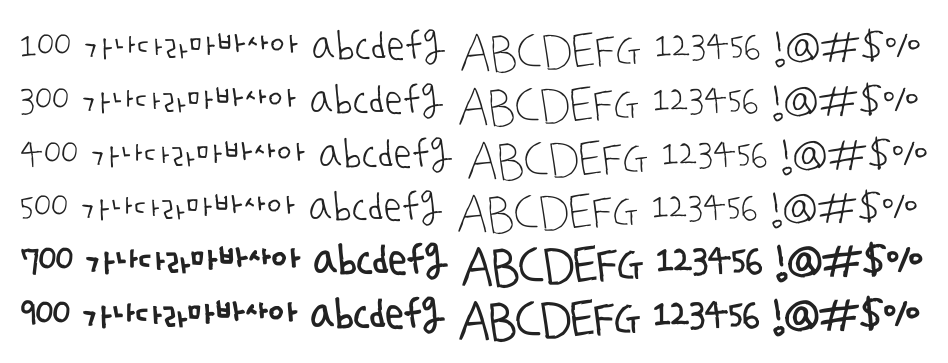

# @noonnu/uhbee-na-hyun

어비 나현체 - 오밀조밀 조그만한 글씨를 씁니다



## Install

```bash
npm install @noonnu/uhbee-na-hyun --save
```

### Import the CSS file

```js
import '@noonnu/uhbee-na-hyun' // esm
// or
require('@noonnu/uhbee-na-hyun') // cjs
```

#### [css-loader](https://github.com/webpack-contrib/css-loader)

```css
@import url('~@noonnu/uhbee-na-hyun');
```

## Usage

```css
body {
    font-family: UhbeeNaHyun;
}
```

## Link

https://noonnu.cc/font_page/179
