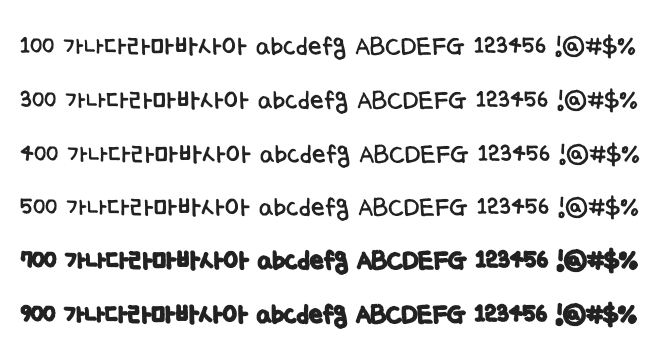

# @noonnu/uiyeun

온글잎 의연체 - 아 여행가고 싶다아아



## Install

```bash
npm install @noonnu/uiyeun --save
```

### Import the CSS file

```js
import '@noonnu/uiyeun' // esm
// or
require('@noonnu/uiyeun') // cjs
```

#### [css-loader](https://github.com/webpack-contrib/css-loader)

```css
@import url('~@noonnu/uiyeun');
```

## Usage

```css
body {
    font-family: Uiyeun;
}
```

## Link

https://noonnu.cc/font_page/667
