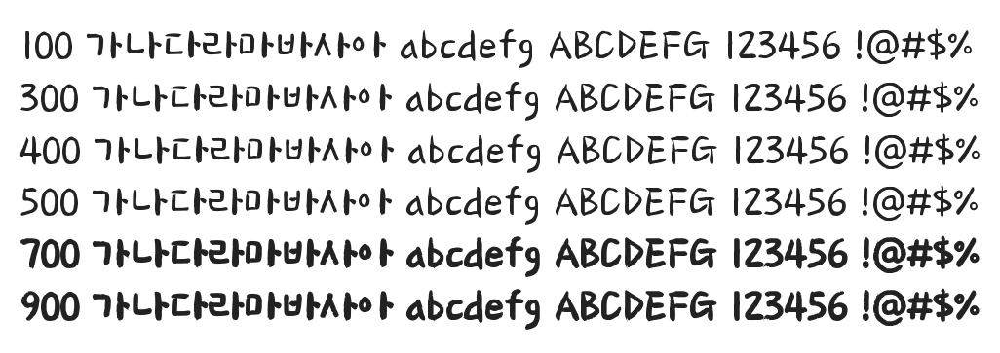

# @noonnu/wandohope-r

완도희망체 - 청정하고 넉넉한 바다를 닮은 서체



## Install

```bash
npm install @noonnu/wandohope-r --save
```

### Import the CSS file

```js
import '@noonnu/wandohope-r' // esm
// or
require('@noonnu/wandohope-r') // cjs
```

#### [css-loader](https://github.com/webpack-contrib/css-loader)

```css
@import url('~@noonnu/wandohope-r');
```

## Usage

```css
body {
    font-family: WandohopeR;
}
```

## Link

https://noonnu.cc/font_page/471
