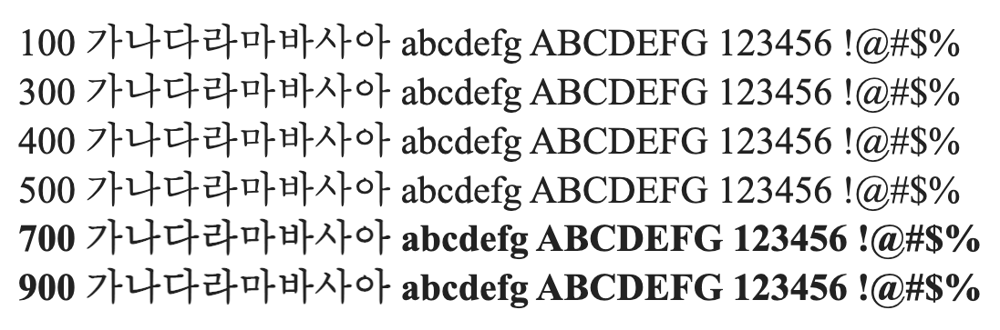

# @noonnu/win-kor

윈도한글 - 날씨가 맑으면 좋지만 더워



## Install

```bash
npm install @noonnu/win-kor --save
```

### Import the CSS file

```js
import '@noonnu/win-kor' // esm
// or
require('@noonnu/win-kor') // cjs
```

#### [css-loader](https://github.com/webpack-contrib/css-loader)

```css
@import url('~@noonnu/win-kor');
```

## Usage

```css
body {
    font-family: WinKor;
}
```

## Link

https://noonnu.cc/font_page/956
