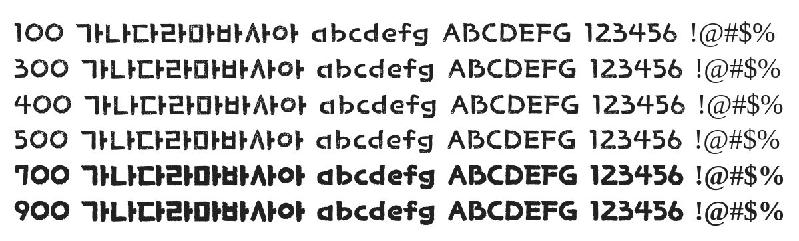

# @noonnu/wolin

월인석보체 - 옛말 맞는 거 하나도 없더라



## Install

```bash
npm install @noonnu/wolin --save
```

### Import the CSS file

```js
import '@noonnu/wolin' // esm
// or
require('@noonnu/wolin') // cjs
```

#### [css-loader](https://github.com/webpack-contrib/css-loader)

```css
@import url('~@noonnu/wolin');
```

## Usage

```css
body {
    font-family: Wolin;
}
```

## Link

https://noonnu.cc/font_page/107
