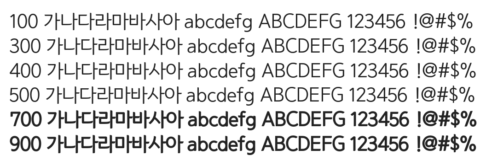

# @noonnu/won-dotum

한둥근돋움 - 포기는 배추 셀 때나 쓰는 말이지



## Install

```bash
npm install @noonnu/won-dotum --save
```

### Import the CSS file

```js
import '@noonnu/won-dotum' // esm
// or
require('@noonnu/won-dotum') // cjs
```

#### [css-loader](https://github.com/webpack-contrib/css-loader)

```css
@import url('~@noonnu/won-dotum');
```

## Usage

```css
body {
    font-family: WONDotum;
}
```

## Link

https://noonnu.cc/font_page/20
