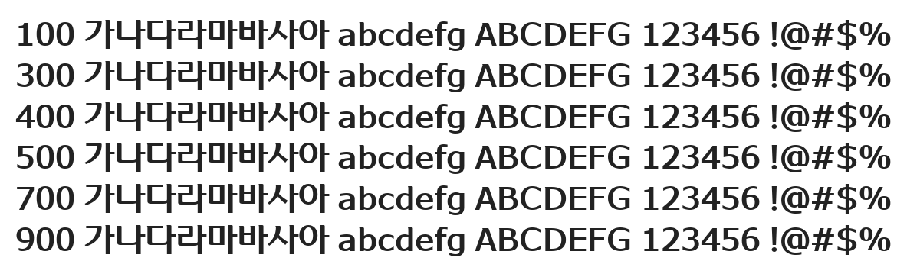

# @noonnu/wooridaum-b

우리다움체 - 우리다움, 나다움이라는게 뭘까



## Install

```bash
npm install @noonnu/wooridaum-b --save
```

### Import the CSS file

```js
import '@noonnu/wooridaum-b' // esm
// or
require('@noonnu/wooridaum-b') // cjs
```

#### [css-loader](https://github.com/webpack-contrib/css-loader)

```css
@import url('~@noonnu/wooridaum-b');
```

## Usage

```css
body {
    font-family: WooridaumB;
}
```

## Link

https://noonnu.cc/font_page/910
