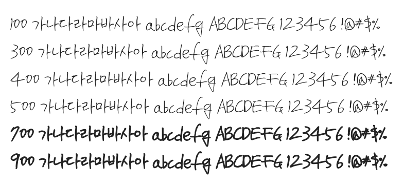

# @noonnu/yak

안될과학 약체 - 균형을 잡으려면 계속 움직여야 해



## Install

```bash
npm install @noonnu/yak --save
```

### Import the CSS file

```js
import '@noonnu/yak' // esm
// or
require('@noonnu/yak') // cjs
```

#### [css-loader](https://github.com/webpack-contrib/css-loader)

```css
@import url('~@noonnu/yak');
```

## Usage

```css
body {
    font-family: Yak;
}
```

## Link

https://noonnu.cc/font_page/917
