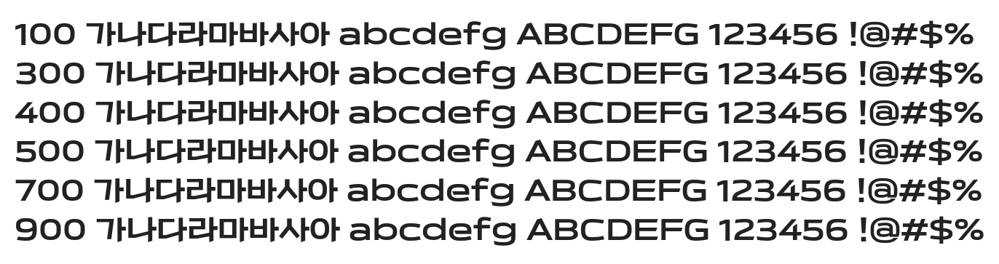

# @noonnu/ydestreet-b

Y이드스트릿체 - 개성넘치는 와이드 폰트



## Install

```bash
npm install @noonnu/ydestreet-b --save
```

### Import the CSS file

```js
import '@noonnu/ydestreet-b' // esm
// or
require('@noonnu/ydestreet-b') // cjs
```

#### [css-loader](https://github.com/webpack-contrib/css-loader)

```css
@import url('~@noonnu/ydestreet-b');
```

## Usage

```css
body {
    font-family: YdestreetB;
}
```

## Link

https://noonnu.cc/font_page/771
