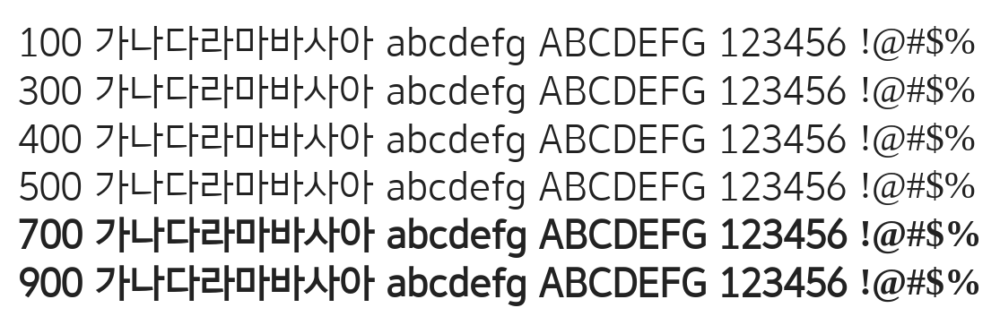

# @noonnu/yeolrin-gothic-light

열린고딕 - 모던하고 깔끔한 고딕 폰트



## Install

```bash
npm install @noonnu/yeolrin-gothic-light --save
```

### Import the CSS file

```js
import '@noonnu/yeolrin-gothic-light' // esm
// or
require('@noonnu/yeolrin-gothic-light') // cjs
```

#### [css-loader](https://github.com/webpack-contrib/css-loader)

```css
@import url('~@noonnu/yeolrin-gothic-light');
```

## Usage

```css
body {
    font-family: YeolrinGothic-Light;
}
```

## Link

https://noonnu.cc/font_page/359
