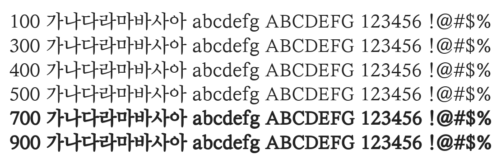

# @noonnu/yes-myoungjo-regular

예스 명조 - 책 속에서 만날 수 있는 깊은 정보



## Install

```bash
npm install @noonnu/yes-myoungjo-regular --save
```

### Import the CSS file

```js
import '@noonnu/yes-myoungjo-regular' // esm
// or
require('@noonnu/yes-myoungjo-regular') // cjs
```

#### [css-loader](https://github.com/webpack-contrib/css-loader)

```css
@import url('~@noonnu/yes-myoungjo-regular');
```

## Usage

```css
body {
    font-family: YESMyoungjo-Regular;
}
```

## Link

https://noonnu.cc/font_page/406
