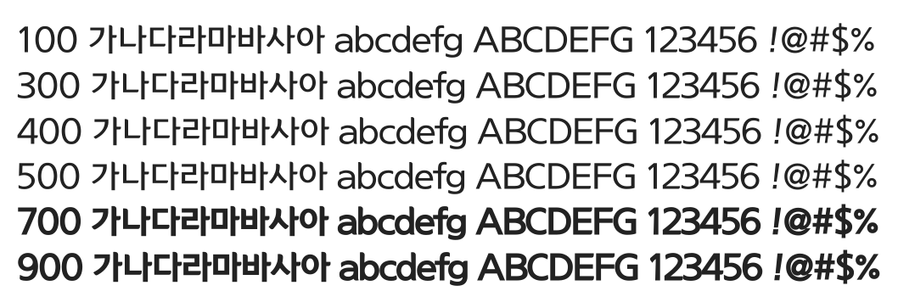

# @noonnu/yi-sun-shin-dotum-m

이순신돋움체 - 하늘 아래 초록이 예쁘더라



## Install

```bash
npm install @noonnu/yi-sun-shin-dotum-m --save
```

### Import the CSS file

```js
import '@noonnu/yi-sun-shin-dotum-m' // esm
// or
require('@noonnu/yi-sun-shin-dotum-m') // cjs
```

#### [css-loader](https://github.com/webpack-contrib/css-loader)

```css
@import url('~@noonnu/yi-sun-shin-dotum-m');
```

## Usage

```css
body {
    font-family: YiSunShinDotumM;
}
```

## Link

https://noonnu.cc/font_page/66
