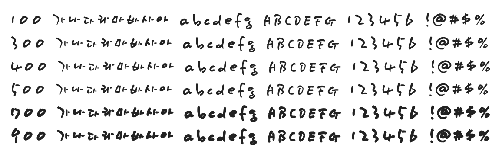

# @noonnu/yoon-shs

Yoon 흥수 - 글씨는 그 사람 마음의 거울



## Install

```bash
npm install @noonnu/yoon-shs --save
```

### Import the CSS file

```js
import '@noonnu/yoon-shs' // esm
// or
require('@noonnu/yoon-shs') // cjs
```

#### [css-loader](https://github.com/webpack-contrib/css-loader)

```css
@import url('~@noonnu/yoon-shs');
```

## Usage

```css
body {
    font-family: YoonSHS;
}
```

## Link

https://noonnu.cc/font_page/351
