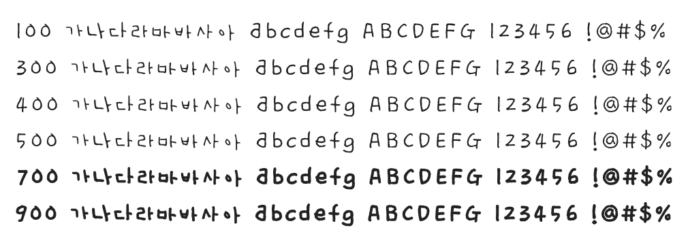

# @noonnu/yoon-sjh

Yoon 지희 - 글씨에서 사람의 개성이 보인다



## Install

```bash
npm install @noonnu/yoon-sjh --save
```

### Import the CSS file

```js
import '@noonnu/yoon-sjh' // esm
// or
require('@noonnu/yoon-sjh') // cjs
```

#### [css-loader](https://github.com/webpack-contrib/css-loader)

```css
@import url('~@noonnu/yoon-sjh');
```

## Usage

```css
body {
    font-family: YoonSJH;
}
```

## Link

https://noonnu.cc/font_page/350
