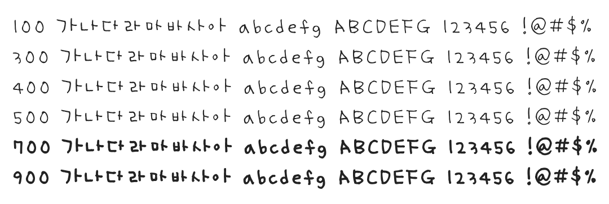

# @noonnu/yoon-ssh

Yoon 세희 - 윤디자인이 공모전으로 만든 손글씨체



## Install

```bash
npm install @noonnu/yoon-ssh --save
```

### Import the CSS file

```js
import '@noonnu/yoon-ssh' // esm
// or
require('@noonnu/yoon-ssh') // cjs
```

#### [css-loader](https://github.com/webpack-contrib/css-loader)

```css
@import url('~@noonnu/yoon-ssh');
```

## Usage

```css
body {
    font-family: YoonSSH;
}
```

## Link

https://noonnu.cc/font_page/347
