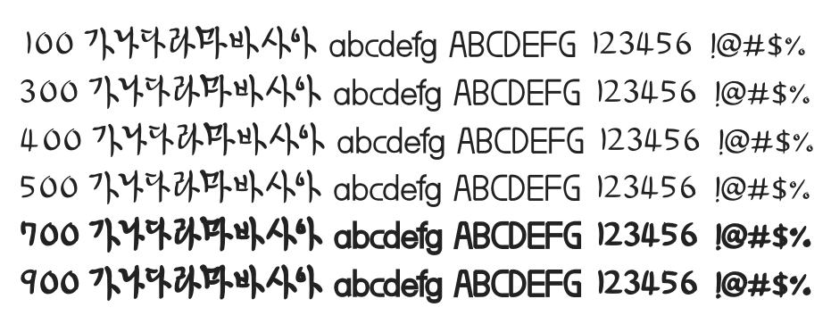

# @noonnu/yun-bong-gil

윤봉길체 - 윤봉길 독립운동가의 글씨체



## Install

```bash
npm install @noonnu/yun-bong-gil --save
```

### Import the CSS file

```js
import '@noonnu/yun-bong-gil' // esm
// or
require('@noonnu/yun-bong-gil') // cjs
```

#### [css-loader](https://github.com/webpack-contrib/css-loader)

```css
@import url('~@noonnu/yun-bong-gil');
```

## Usage

```css
body {
    font-family: YUN-BONG-GIL;
}
```

## Link

https://noonnu.cc/font_page/369
