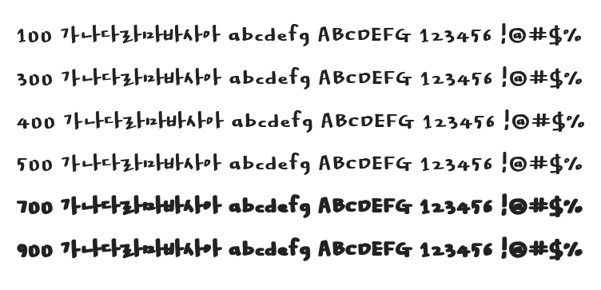

# @noonnu/yun-taemin

윤고래체 - 한글과 맞춤범은 서로 상관이 없어



## Install

```bash
npm install @noonnu/yun-taemin --save
```

### Import the CSS file

```js
import '@noonnu/yun-taemin' // esm
// or
require('@noonnu/yun-taemin') // cjs
```

#### [css-loader](https://github.com/webpack-contrib/css-loader)

```css
@import url('~@noonnu/yun-taemin');
```

## Usage

```css
body {
    font-family: YunTaemin;
}
```

## Link

https://noonnu.cc/font_page/21
